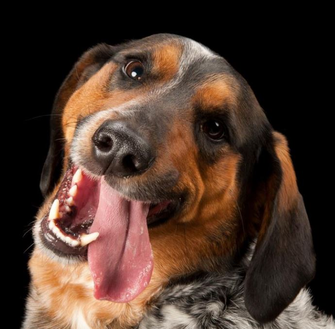
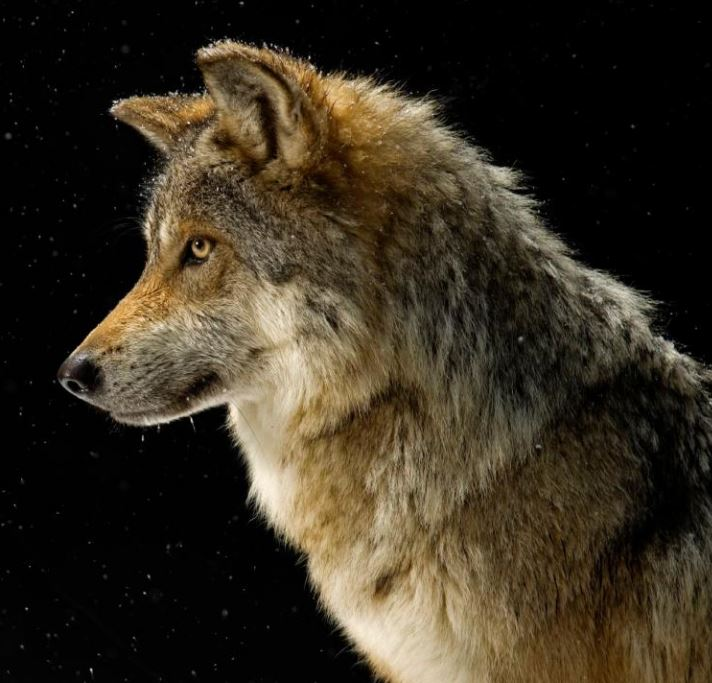

<!-- markdownlint-disable MD033 -->

# [Domaći pas](https://hr.wikipedia.org/wiki/Doma%C4%87i_pas)

<figure class="figure">
    
    <figcaption class="figure__caption">Veseli pas</figcaption>
</figure>

## Psi

Psi su bili prve domaće životinje među sisavcima. Ljudi su ih pripitomili prije otprilike 12 000 godina. Sve pasmine potječu od vuka (Canis lupus) unatoč tvrdnjama nekih da potječu i od lisica.

Psi su vjerojatno prve pripitomljene životinje, koje čovjeku vjerno služe sve do danas. Ljudi su ih selektivno razmnožavali za mnoge namjene, a rezultat je toga životinja različitih oblika, veličina i sposobnosti.

Pas, Canis familiaris, kralježnjak je, sisavac i zvijer, pripadnik porodice pasa (Canidae) koja obuhvaća i lisicu, čaglja, vuka te australskog dinga. Njuška mu je vlažna, posjeduje izvrstan njuh i vrlo je druželjubiv. Izrazito dobro trči i spretno pliva te može vrlo brzo mijenjati smjer trka. Dok spava, često ga prate sni u kojima trza repom, cvili i potiho laje i reži.

Smatra se da je predak psa bila životinja slična vuku - vjerojatno mješanac izmedu vuka i čaglja - koja je živjela prije nekoliko milijuna godina. Čak se i danas pripitomljeni psi mogu uspješno razmnožavati s vukovima i čagljevima. Neki smatraju da se svi psi mogu podijeliti u dvije velike skupine - na one koji su slični vukovima i na one koji su slični čagljevima.

## Porijeklo od vukova

<figure class="figure">
    
    <figcaption class="figure__caption">Vuk</figcaption>
</figure>

Smatra se da je predak psa bila životinja slična vuku - vjerojatno mješanac izmedu vuka i čaglja - koja je živjela prije nekoliko milijuna godina. Čak se i danas pripitomljeni psi mogu uspješno razmnožavati s vukovima i čagljevima. Neki smatraju da se svi psi mogu podijeliti u dvije velike skupine - na one koji su slični vukovima i na one koji su slični čagljevima.Smatra se da je predak psa bila životinja slična vuku - vjerojatno mješanac izmedu vuka i čaglja - koja je živjela prije nekoliko milijuna godina. Čak se i danas pripitomljeni psi mogu uspješno razmnožavati s vukovima i čagljevima. Neki smatraju da se svi psi mogu podijeliti u dvije velike skupine - na one koji su slični vukovima i na one koji su slični čagljevima.