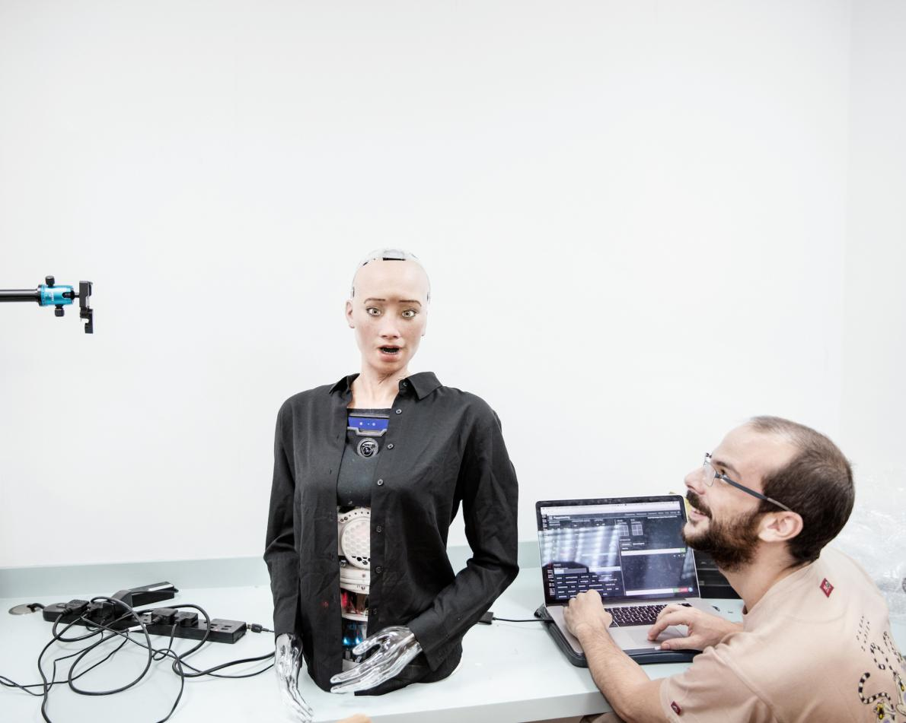
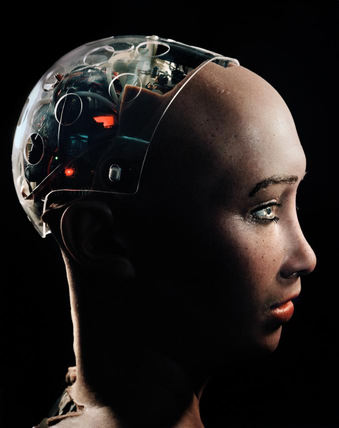

<!-- markdownlint-disable MD033 -->

# [Sophia](https://en.wikipedia.org/wiki/Sophia_(robot))

<figure class="figure">
    
    <figcaption class="figure__caption">Sophie sa svojim izumiteljem</figcaption>
</figure>

## Sophie

Humanoidni robot opremljen umjetnom inteligencijom koji je nedavno dobio državljanstvo u Saudijskoj Arabiji smatra kako će u budućnosti strojevi poput nje biti zasebne osobnosti

<figure class="figure">
    
    <figcaption class="figure__caption">Profil Sophie</figcaption>
</figure>

Sophia, robot ljudskog lica tvrtke Hanson Robotics, svojedobno je rekla kako treba sve nas ljude poubijati. Pa je potom predložila da postane veleposlanica robota u odnosima s ljudima. 

Sad, navodno, želi zasnovati vlastitu obitelj i imati djecu.
Prema riječima Davida Hansona, osnivača Hanson Roboticsa, androidi poput Sophie primjenu će naći u područjima zdravstvene skrbi, terapijske djelatnosti, obrazovanja i uslužnih djelatnosti. 

Sophijino lice i vrat se sastoje od 62 različitih jedinica koje djeluju usklađeno kako bi stvorile pokrete koji djeluju koliko-toliko prirodno. U oči su joj ugrađene kamere opremljene tehnologijom prepoznavanja lica, pa tako ne samo zna s kime razgovara već može očitati i reakcije na svoje izjave. 