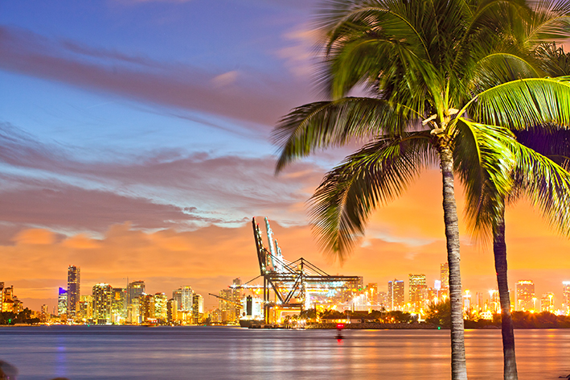

<!-- markdownlint-disable MD033 -->

# [Miami](https://hr.wikipedia.org/wiki/Miami,_Florida)

<figure class="figure">
    
    <figcaption class="figure__caption">Palme Miamia</figcaption>
</figure>

Miami je grad smješten u jugoistočnom kutu američke savezne države Floride. Miami je drugi najveći grad na Floridi te najveći grad i sjedište okruga Miami-Dade. Također je najveći grad u metropolitanskom području ("Područje utjecaja") južne Floride, koje se sastoji od okruga Miami-Dade, Broward i Palm Beach te je najveće metropolitansko područje u jugoistočnom SAD-u.

Veliki porast broja stanovnika posljednjih godina rezultat je migracija unutar SAD-a kao i imigracije. Šire područje Miamija mjesto je gdje se susreću brojne kulture i nalazi se pod snažnim utjecajem velike populacije etničkih Latinoamerikanaca i karipskih otočana, od kojih su mnogi izvorni govornici španjolskog i haićanskog jezika.

Važnost regije kao međunarodnog financijskog i kulturalnog središta uzdigla je Miami do statusa svjetskog grada, a uz Atlantu grad je jedno od najvažnijih poslovnih središta u jugoistočnom SAD-u.
Veliki porast broja stanovnika posljednjih godina rezultat je migracija unutar SAD-a kao i imigracije. Šire područje Miamija mjesto je gdje se susreću brojne kulture i nalazi se pod snažnim utjecajem velike populacije etničkih Latinoamerikanaca i karipskih otočana, od kojih su mnogi izvorni govornici španjolskog i haićanskog jezika.

Važnost regije kao međunarodnog financijskog i kulturalnog središta uzdigla je Miami do statusa svjetskog grada, a uz Atlantu grad je jedno od najvažnijih poslovnih središta u jugoistočnom SAD-u.

## Povijest Miamia

<figure class="figure">
    
    <figcaption class="figure__caption">Poznata plaža Miamia</figcaption>
</figure>

Miami je kao grad službeno osnovan 28. srpnja 1896. godine, dok je područje na kojem je grad osnovan bilo naseljeno više od tisuću godina Tequesta Indijancima, a to je područje 1566., Španjolskoj prisvojio Pedro Menéndez de Avilés. Španjolska misija izgrađena je godinu kasnije. Godine 1836., sagrađena je tvrđava Dallas gdje su se odvijale bitke tijekom Drugog seminolskog rata. U 1920-ima, događa se veliki porast stanovništva i izgradnje infrastrukture. Do 1940., u Miamiju je živjelo 172 172 stanovnika.

Nagli razvoj grada počinje dolaskom željeznice. Lokalna uzgajivačica citrusa Julia Tuttle, uvjerila je željezničkog magnata Henrya Flaglera u gradnju željeznice sve do Miamija. Dana 28. srpnja 1896., Miami je službeno proglašen gradom s preko 300 stanovnika.

Nagli razvoj grada koji je počeo 1920-ih, poremetile su krize nekretnina, uragan 1926., te velika depresija 1930-ih. Početkom Drugog svjetskog rata, Miami je zbog svog položaja odigrao važnu ulogu u borbi protiv njemačkih podmornica. Rat je potaknuo rast stanovništva čiji se broj podigao na skoro pola milijuna. Dolaskom Castrovog režima na vlast na Kubi 1959. godine, veliki broj Kubanaca doselio se u Miami, što je dodatno povećalo broj stanovnika. Od novijih kriza najznačajnije su pobuna zbog premlaćivanja Arthura McDuffieja, narko ratovi, uragan Andrew, te afera Eliána Gonzáleza. Danas je Miami grad u velikom razvoju, koji privlači veliki broj stanovnika.
