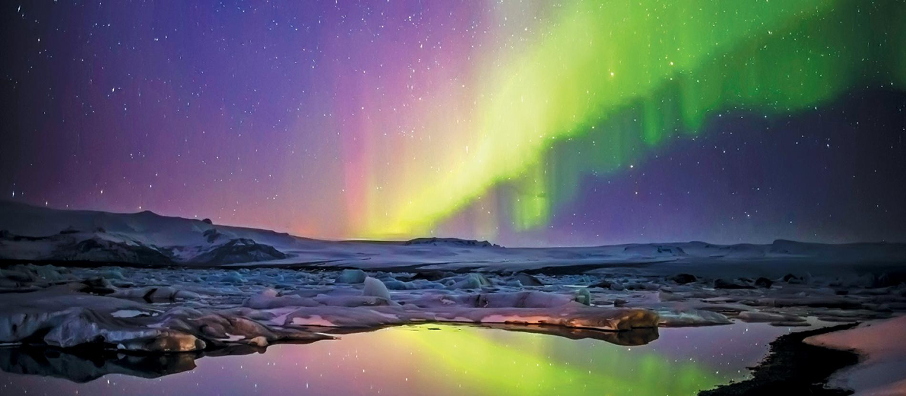

<!-- markdownlint-disable MD033 -->

# [Island](https://hr.wikipedia.org/wiki/Island)

<figure class="figure">
    
    <figcaption class="figure__caption">Fjordovi Islanda </figcaption>
</figure>

## Island

Island je bio jedan od najvećih otoka na svijetu koje čovjek nije naselio, dok u kasnom devetom i desetom stoljeću nisu došli norveški i keltski (škotski i irski) imigranti. Island ima najstariji parlament na svijetu, Althing, osnovan 930. godine. Neki pisani izvori navode da su irski redovnici živjeli na Islandu prije dolaska norveških naseljenika, ali nisu nađeni arheološki dokazi koji bi potkrijepili ovu tvrdnju.

Island je bio neovisan 300 godina, a zatim su njime vladali Norveška i Danska. Formalno je bio norveška kolonija, do 1814. godine, kada se zajednička država Norveške i Danske razdvojila sporazumom iz Kiela, a Island je postao ovisan teritorij Danske. Od danske vlade je dobio ograničenu autonomnu vlast, 1874. godine, a protektoratsku neovisnost i suverenitet u unutrašnjim pitanjima 1918. Vanjski odnosi i obrana su ostali pod danskom upravom do Drugog svjetskog rata, kada je Njemačka vojno okupirala Dansku, 1940. Island su, nakon toga, okupirali saveznici. Danski kralj je de jure ostao suveren do 1944. godine, kada je današnja republika osnovana u nedostatku danske vlasti.
## Politika Islanda

<figure class="figure">
    
    <figcaption class="figure__caption">Aurora Borealis</figcaption>
</figure>

Island je bio jedan od najvećih otoka na svijetu koje čovjek nije naselio, dok u kasnom devetom i desetom stoljeću nisu došli norveški i keltski (škotski i irski) imigranti. Island ima najstariji parlament na svijetu, Althing, osnovan 930. godine. Neki pisani izvori navode da su irski redovnici živjeli na Islandu prije dolaska norveških naseljenika, ali nisu nađeni arheološki dokazi koji bi potkrijepili ovu tvrdnju.

Island je bio neovisan 300 godina, a zatim su njime vladali Norveška i Danska. Formalno je bio norveška kolonija, do 1814. godine, kada se zajednička država Norveške i Danske razdvojila sporazumom iz Kiela, a Island je postao ovisan teritorij Danske. Od danske vlade je dobio ograničenu autonomnu vlast, 1874. godine, a protektoratsku neovisnost i suverenitet u unutrašnjim pitanjima 1918. Vanjski odnosi i obrana su ostali pod danskom upravom do Drugog svjetskog rata, kada je Njemačka vojno okupirala Dansku, 1940. Island su, nakon toga, okupirali saveznici. Danski kralj je de jure ostao suveren do 1944. godine, kada je današnja republika osnovana u nedostatku danske vlasti.
